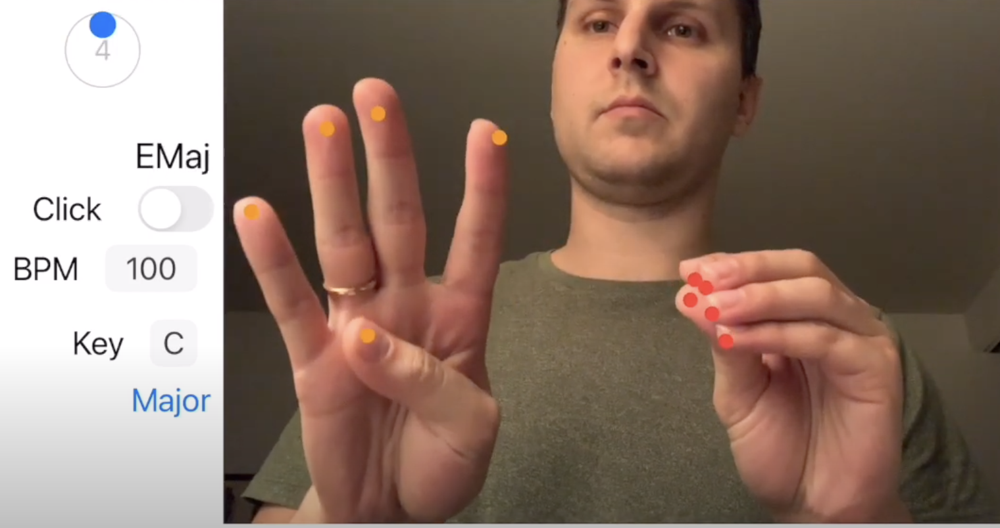
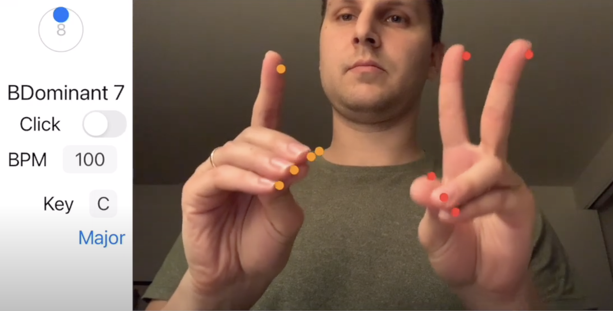

# Summary
Use the iPhone's camera as an interface to control a MIDI instrument with hand poses.

## Demos
v0.7 Demo [Pitch detection](https://youtu.be/4i56fL4DtMI)  
v0.6 Demo [Synchronize & Harmonize](https://youtu.be/q5FyHPM2y7Y)  

## Intentions
1 Play along to an existing song  
2 Use it for original songwriting

## How To Use
Phone must be on its right side (landscape left orientation)  
You will queue chords to a beat using the position of your left and right hands

Play chords by pulling fingers away from your thumb; these gestures signify numbers. All fingers pinched together will play no chord. 

Left hand controls chord played, right hand can modify the chord  
Left hand numbers signify chords I-VII

### Left Hand (Chord Numbers)
Numbers 1-4 are made with the near-universal gestures for numbers 1-4  
5 is made by moving the pinky away from the thumb  
6 by moving both pinky and ring finger away from the thumb  
7 by moving pinky, ring finger, and middle finger away from the thumb (only pinching the pointer to the thumb)

### Right Hand (Chord Types)
1: Major Triad
2: Major 7th
3: Dominant 7th
4: Minor Triad
5: Minor 7th
6: Half Diminished
7: Sus4
